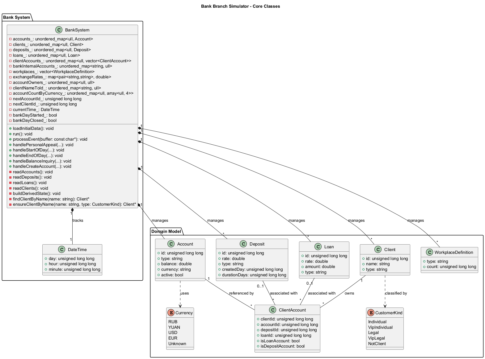
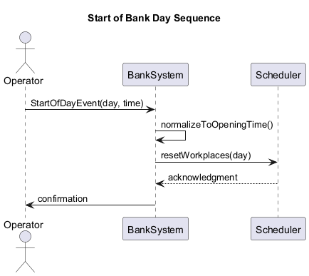
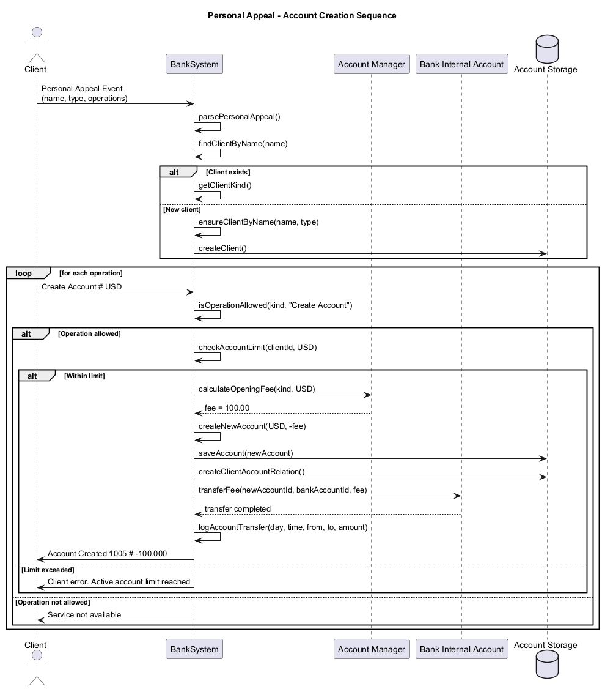

# 银行分行模拟器（任务二）

本项目实现了"C++ ФИТ 2025 - Задача 2"中的银行分行领域模拟。程序使用标准输入读取初始数据与事件流，按照题目要求输出操作结果与错误信息，并通过 `stderr` 记录交易日志。

## 项目状态

**项目已成功构建并运行！**

- 使用CMake构建系统，编译成功
- 单元测试100%通过
- 银行业务模拟正常工作
- 支持多种客户类型和货币
- 完整的交易日志记录

## 已实现功能

### 核心业务功能
- **账户余额查询** - 客户可查询自己的账户余额
- **开户服务** - 支持不同客户类型和货币的开户
- **新客户注册** - 自动为新客户创建档案
- **手续费计算** - 根据客户类型和货币计算不同的手续费
- **账户数量限制** - 检查客户的账户数量限制
- **交易日志** - 记录所有资金流动

### 支持的客户类型
- **Individual Client** (个人客户)
- **VIP Individual Client** (优先个人客户)  
- **Legal Entity** (法人实体)
- **VIP Legal Entity** (优先法人实体)

### 支持的货币
- **RUB** (卢布) - **USD** (美元) - **EUR** (欧元) - **YUAN** (人民币)

### 手续费规则
开户手续费根据客户类型和货币不同：

| 货币 | 个人客户 | 优先个人客户 | 法人实体 | 优先法人实体 |
|------|----------|--------------|----------|--------------|
| RUB  | 10,000   | 4,000        | 25,000   | 15,000       |
| USD  | 100      | 50           | 200      | 100          |
| EUR  | 100      | 50           | 200      | 100          |
| YUAN | 2,000    | 1,000        | 5,000    | 2,000        |

## 快速开始

### 构建项目

```powershell
# 配置构建系统
cmake -S . -B build

# 编译项目
cmake --build build --config Release
```

### 运行测试

```powershell
# 运行单元测试
ctest --test-dir build -C Release --output-on-failure
```

### 运行模拟器

#### 方式一：使用提供的脚本（推荐）

```powershell
# 运行基础演示
.\run_demo.bat

# 运行复杂演示（多客户类型、多货币）
.\run_complex.bat
```

#### 方式二：手动运行

```powershell
# Windows CMD方式
cmd /c "build\Release\bank_sim.exe < input.txt > output.txt 2> log.txt"
```

- `output.txt`：业务处理结果（标准输出）
- `log.txt`：交易日志（错误输出，记录资金流动）

## 运行示例

### 快速演示

运行提供的演示脚本：
```powershell
.\run_demo.bat        # 基础演示
.\run_complex.bat     # 复杂演示
```

### 演示结果

**基础演示输出：**
```
1 # 9:30 # Balance of 1001 # 50000.000
1 # 9:30 # Account Created 1007 # -100.000
1 # 9:30 # Balance of 1001 # 50000.000
1 # 10:15 # Balance of 1005 # 20000.000
1 # 10:15 # Account Created 1008 # -50.000
1 # 11:0 # Client error. Wrong operation for new client
```

**交易日志：**
```
1 # 9:30 # 1007 -> 1002 # 100.000
1 # 10:15 # 1008 -> 1004 # 50.000
```

### 输入文件格式
```
Accounts 4
1001 # deposit # 50000.000 # RUB
1002 # deposit # 10000.000 # USD
1003 # deposit # 100000.000 # RUB
1004 # deposit # 5000.000 # EUR

Clients 2
4001 # Ivanov Ivan Ivanovich # Individual Client
4002 # Petrov Petr Petrovich # VIP Individual Client

1 # 8:00 # Start of Bank Day
1 # 9:30 # Personal Appeal # Ivanov Ivan Ivanovich # Individual # 2
Balance Inquiry # 1001
Create Account # USD
1 # 19:00 # End of Bank Day
```

### 🎬 实际运行示例分析

让我们通过一个完整的运行示例来理解代码执行流程：

#### 输入数据示例
```
Accounts 4
1001 # deposit # 50000.000 # RUB
1002 # deposit # 10000.000 # USD
1003 # deposit # 100000.000 # RUB  
1004 # deposit # 5000.000 # EUR

Clients 2
4001 # Ivanov Ivan Ivanovich # Individual Client
4002 # Petrov Petr Petrovich # VIP Individual Client

Client Debit 2
4001 # 1001 # 2001
4002 # 1005 # 0

Bank Accounts 2
1003  # RUB银行内部账户
1002  # USD银行内部账户

1 # 8:00 # Start of Bank Day
1 # 9:30 # Personal Appeal # Ivanov Ivan Ivanovich # Individual # 2
Balance Inquiry # 1001
Create Account # USD
1 # 19:00 # End of Bank Day
```

#### 执行流程追踪

**阶段1：系统初始化**
```cpp
// main.cpp
BankSystem bankSystem;                    // 创建系统实例
bankSystem.loadInitialData();            // 开始数据加载

// BankSystem::loadInitialData()
readAccounts();    // accounts_[1001] = {id:1001, balance:50000.0, currency:"RUB"}
                   // accounts_[1002] = {id:1002, balance:10000.0, currency:"USD"}
                   // accounts_[1003] = {id:1003, balance:100000.0, currency:"RUB"}
                   // accounts_[1004] = {id:1004, balance:5000.0, currency:"EUR"}

readClients();     // clients_[4001] = {id:4001, name:"Ivanov Ivan Ivanovich", type:"Individual Client"}
                   // clients_[4002] = {id:4002, name:"Petrov Petr Petrovich", type:"VIP Individual Client"}

readClientAccounts(); // clientAccounts_[4001] = [{clientId:4001, accountId:1001, depositId:2001}]
                      // clientAccounts_[4002] = [{clientId:4002, accountId:1005, depositId:0}]

readBankAccounts();   // bankInternalAccounts_["RUB"] = 1003
                      // bankInternalAccounts_["USD"] = 1002

buildDerivedState();  // accountOwners_[1001] = 4001  (账户1001属于客户4001)
                      // clientNameToId_["Ivanov Ivan Ivanovich"] = 4001
                      // nextAccountId_ = 1005  (下一个账户ID)
```

**阶段2：事件处理循环**
```cpp
// BankSystem::run()
while (std::fgets(buffer, sizeof(buffer), stdin)) {
    processEvent(buffer);
}
```

**事件1：银行营业日开始**

```cpp
// 输入: "1 # 8:00 # Start of Bank Day"
processEvent("1 # 8:00 # Start of Bank Day");
  ↓
handleStartOfDay(1, 8, 0);
  ↓
currentTime_ = {day:1, hour:8, minute:0};  // 设置营业时间
bankDayStarted_ = true;                    // 标记营业开始
bankDayClosed_ = false;
```

**事件2：客户办理业务**

```cpp
// 输入: "1 # 9:30 # Personal Appeal # Ivanov Ivan Ivanovich # Individual # 2"
//       "Balance Inquiry # 1001"
//       "Create Account # USD"

processEvent("1 # 9:30 # Personal Appeal # Ivanov Ivan Ivanovich # Individual # 2");
  ↓
handlePersonalAppeal(1, 9, 30, "Personal Appeal # Ivanov Ivan Ivanovich # Individual # 2");
  ↓
// 解析客户信息
name = "Ivanov Ivan Ivanovich"
typeToken = "Individual"  
operationCount = 2

// 查找客户
client = findClientByName("Ivanov Ivan Ivanovich");
  ↓ clientNameToId_["Ivanov Ivan Ivanovich"] = 4001
  ↓ clients_[4001] = 找到客户
kind = parseCustomerKind("Individual Client") = CustomerKind::Individual

// 处理操作1: Balance Inquiry # 1001
operation = "Balance Inquiry # 1001"
  ↓
handleBalanceInquiry(client, 1001, 1, 9, 30);
  ↓
account = findAccount(1001);              // 找到账户1001
owner = accountOwners_[1001] = 4001;      // 验证账户属于客户4001
fmt = formatMoney(50000.0);               // 格式化金额
  ↓
输出: "1 # 9:30 # Balance of 1001 # 50000.000"

// 处理操作2: Create Account # USD
operation = "Create Account # USD"
  ↓
handleCreateAccount(client, CustomerKind::Individual, "USD", 1, 9, 30);
  ↓
currency = parseCurrency("USD") = Currency::USD
allowedAccounts = accountLimit(Individual, USD) = 1     // 个人客户USD账户限制为1个
currentCount = accountCountByCurrency_[4001][2] = 0     // 当前USD账户数为0
fee = accountOpeningFee(Individual, USD) = 100.0        // 个人客户USD开户费100

// 创建新账户
accountId = nextAccountId_++ = 1005
newAccount = {id:1005, type:"deposit", balance:-100.0, currency:"USD", active:true}
accounts_[1005] = newAccount

// 建立关系
rel = {clientId:4001, accountId:1005, depositId:0}
clientAccounts_[4001].push_back(rel)
accountOwners_[1005] = 4001
accountCountByCurrency_[4001][2] = 1  // USD账户数+1

// 银行收取手续费
bankAccountId = bankInternalAccounts_["USD"] = 1002
bankAccount = findAccount(1002)
bankAccount->balance += 100.0  // 银行USD账户余额: 10000.0 + 100.0 = 10100.0

// 记录交易日志
logAccountTransfer(1, 9, 30, 1005, 1002, 100.0);
  ↓
输出到stderr: "1 # 9:30 # 1005 -> 1002 # 100.000"

// 输出开户结果
fmt = formatMoney(-100.0) = {negative:true, major:100, minor:0}
  ↓
输出: "1 # 9:30 # Account Created 1005 # -100.000"
```

**最终系统状态：**
```cpp
// 账户状态
accounts_[1001].balance = 50000.0   // 原有RUB账户
accounts_[1002].balance = 10100.0   // 银行USD账户(收到手续费)
accounts_[1005].balance = -100.0    // 新创建的USD账户(扣除手续费)

// 客户关系
clientAccounts_[4001] = [
    {clientId:4001, accountId:1001, depositId:2001},  // 原有关系
    {clientId:4001, accountId:1005, depositId:0}      // 新建关系
]

// 账户计数
accountCountByCurrency_[4001][2] = 1  // 客户4001的USD账户数为1

// ID生成器
nextAccountId_ = 1006  // 为下次创建账户准备
```

#### 输出结果分析

**标准输出 (stdout)：**
```
1 # 9:30 # Balance of 1001 # 50000.000    ← 余额查询结果
1 # 9:30 # Account Created 1005 # -100.000 ← 开户成功，余额为负(手续费)
```

**交易日志 (stderr)：**
```
1 # 9:30 # 1005 -> 1002 # 100.000  ← 手续费从新账户转到银行账户
```

这个完整的执行流程展示了：
1. **数据驱动**：所有操作基于预加载的数据结构
2. **状态一致性**：多个数据结构同步更新
3. **业务规则**：严格按照客户类型和货币计算手续费
4. **日志完整性**：所有资金流动都有记录
5. **错误处理**：权限验证和业务规则检查

### 🎯 实际运行示例分析

## 项目结构

```
├── CMakeLists.txt          # 总入口，生成可执行程序与单元测试
├── include/
│   ├── Domain.hpp          # 领域数据模型、工具函数
│   └── Bank.hpp            # BankSystem 对外接口
├── src/
│   ├── Bank.cpp            # 主要业务逻辑与输入解析
│   └── main.cpp            # 程序入口
├── tests/
│   ├── CMakeLists.txt
│   └── test_money.cpp      # 金额四舍五入逻辑的回归测试
├── docs/
│   ├── bank_classes.puml   # UML 类图（PlantUML）
│   └── bank_sequence_start_day.puml # Start of Bank Day 序列图
├── demo_input.txt          # 基础演示输入文件
├── complex_demo.txt        # 复杂演示输入文件
├── run_demo.bat           # 基础演示脚本
├── run_complex.bat        # 复杂演示脚本
├── 新手指导.md             # 学习、调试、扩展说明
└── 第二题.md               # 完整题目描述
```

## UML 设计图表

### 系统架构类图



**类图说明：**
- **BankSystem**: 核心系统类，管理所有银行业务
- **Account**: 账户实体，包含余额、货币等信息
- **Client**: 客户实体，支持多种客户类型
- **Deposit**: 存款产品，包含利率和期限
- **Loan**: 贷款产品，包含利率和金额
- **ClientAccount**: 客户与账户的关联关系

### 业务流程序列图



**银行营业日开始流程：**
- 展示了银行营业日开始的完整流程
- 包含时间标准化和工作岗位重置
- 体现了系统各组件间的交互关系



**客户办理业务流程：**
- 展示了客户亲临办理业务的完整流程
- 包含客户验证、权限检查、账户创建等步骤
- 体现了手续费计算和交易日志记录过程

### 生成UML图表

如需重新生成或修改UML图表，可使用PlantUML：

```powershell
# 安装PlantUML后运行
plantuml docs/bank_classes.puml
plantuml docs/bank_sequence_start_day.puml
plantuml docs/bank_sequence_personal_appeal.puml

# 或者使用提供的脚本
.\generate_uml.bat
```

## 代码运行流程详解

### 🏗️ 系统架构概览

根据系统架构类图，银行分行模拟器采用分层架构设计：

```
┌─────────────────────────────────────────┐
│              BankSystem                 │  ← 核心控制器
│  ┌─────────────────────────────────────┐│
│  │        Domain Model Package        ││  ← 领域模型层
│  │  Account, Client, Deposit, Loan    ││
│  │  Currency, CustomerKind (枚举)     ││
│  └─────────────────────────────────────┘│
└─────────────────────────────────────────┘
```

### 🚀 程序启动流程

#### 1. 程序入口 (`main.cpp`)

```cpp
int main() {
    try {
        bank::BankSystem bankSystem;        // ① 创建银行系统实例
        bankSystem.loadInitialData();       // ② 加载初始数据
        bankSystem.run();                    // ③ 运行事件循环
    } catch (const std::exception &ex) {
        std::fprintf(stderr, "Unhandled exception: %s\n", ex.what());
        return EXIT_FAILURE;
    }
    return EXIT_SUCCESS;
}
```

#### 2. 系统初始化阶段 (`BankSystem::loadInitialData()`)

根据类图中的BankSystem结构，初始化过程按严格顺序进行：

```cpp
void BankSystem::loadInitialData() {
    readAccounts();         // ① 读取账户表 → accounts_
    readDeposits();         // ② 读取存款表 → deposits_
    readLoans();            // ③ 读取贷款表 → loans_
    readClients();          // ④ 读取客户表 → clients_
    readClientAccounts();   // ⑤ 读取客户账户关联表 → clientAccounts_
    readBankAccounts();     // ⑥ 读取银行内部账户表 → bankInternalAccounts_
    readClientDebts();      // ⑦ 读取客户债务表
    readWorkplaces();       // ⑧ 读取工作岗位表 → workplaces_
    readExchangeRates();    // ⑨ 读取汇率表 → exchangeRates_
    buildDerivedState();    // ⑩ 构建派生状态和索引
}
```

**数据结构映射关系：**
```
输入数据 → 内存结构 → 业务索引
Accounts → accounts_ (unordered_map<ull, Account>)
Clients  → clients_  (unordered_map<ull, Client>)
         → clientNameToId_ (unordered_map<string, ull>)  ← 派生索引
         → accountOwners_  (unordered_map<ull, ull>)     ← 派生索引
```

#### 3. 事件处理循环 (`BankSystem::run()`)

```cpp
void BankSystem::run() {
    char buffer[kLineBuffer];
    while (std::fgets(buffer, sizeof(buffer), stdin)) {
        if (std::strlen(buffer) < 5) continue;
        processEvent(buffer);  // 处理每个事件
    }
}
```

### 🎯 核心业务流程

#### 银行营业日开始流程

根据 `bank_sequence_start_day.png` 序列图：

```
Operator → BankSystem: StartOfDayEvent(day, time)
BankSystem → BankSystem: normalizeToOpeningTime()  // 标准化为8:00
BankSystem → Scheduler: resetWorkplaces(day)
BankSystem → Operator: confirmation
```

**代码实现：**
```cpp
void BankSystem::handleStartOfDay(unsigned long long day, 
                                  unsigned long long hour, 
                                  unsigned long long minute) {
    currentTime_ = {day, 8, 0};        // 无论何时到达，都标准化为8:00
    bankDayStarted_ = true;
    bankDayClosed_ = false;
    // 重置工作岗位状态（未完全实现）
}
```

#### 客户办理业务流程

根据 `bank_sequence_personal_appeal.png` 序列图的详细流程：

```
Client → BankSystem: Personal Appeal Event
BankSystem → BankSystem: parsePersonalAppeal()
BankSystem → BankSystem: findClientByName(name)
[客户存在] → getClientKind()
[新客户] → ensureClientByName() → createClient()

循环处理每个操作：
Client → BankSystem: Create Account # USD
BankSystem → BankSystem: isOperationAllowed(kind, "Create Account")
[允许操作] → checkAccountLimit(clientId, USD)
[在限制内] → calculateOpeningFee(kind, USD) → fee = 100.00
BankSystem → Storage: createNewAccount(USD, -fee)
BankSystem → BankAccount: transferFee(newAccountId, bankAccountId, fee)
BankSystem → BankSystem: logAccountTransfer()
BankSystem → Client: Account Created 1005 # -100.000
```

**代码实现详解：**

1. **事件解析阶段：**
```cpp
void BankSystem::handlePersonalAppeal(unsigned long long day, ...) {
    char name[domain::kMaxString]{};
    char typeToken[domain::kMaxString]{};
    unsigned long long operationCount{};
    
    // 解析Personal Appeal头部
    std::sscanf(payload, "Personal Appeal # %99[a-zA-Z0-9/_ ] # %99[a-zA-Z0-9/_ ] # %llu",
                name, typeToken, &operationCount);
}
```

2. **客户验证阶段：**
```cpp
std::string nameStr(name);
domain::Client* client = findClientByName(nameStr);  // 查找现有客户

if (!client) {
    // 新客户注册逻辑
    kind = domain::parseClientToken(typeToken);
    if (kind == domain::CustomerKind::NotClient) {
        std::printf("Client error. Wrong operation for new client\n");
        return;
    }
    client = ensureClientByName(nameStr, kind);  // 创建新客户
}
```

3. **业务操作处理：**
```cpp
for (const auto& operation : operations) {
    if (operation.rfind("Create Account", 0) == 0) {
        // 权限检查
        if (!isOperationAllowed(kind, "Create Account")) {
            std::printf("Service not available\n");
            continue;
        }
        handleCreateAccount(*client, kind, currency, day, hour, minute);
    }
}
```

4. **开户业务详细流程：**
```cpp
void BankSystem::handleCreateAccount(...) {
    // ① 验证货币和账户限制
    auto currency = domain::parseCurrency(currencyStr);
    auto allowedAccounts = accountLimit(kind, currency);
    auto currentCount = accountCountByCurrency_[client.id][currencyIdx];
    
    if (currentCount >= allowedAccounts) {
        std::printf("Client error. Active account limit reached\n");
        return;
    }
    
    // ② 计算手续费
    double fee = accountOpeningFee(kind, currency);
    double balance = -fee;  // 开户当天余额为负
    
    // ③ 创建新账户
    unsigned long long accountId = nextAccountId_++;
    domain::Account newAccount{};
    newAccount.id = accountId;
    newAccount.type = "deposit";
    newAccount.balance = balance;
    newAccount.currency = currencyStr;
    accounts_.emplace(accountId, newAccount);
    
    // ④ 建立客户-账户关系
    domain::ClientAccount rel{};
    rel.clientId = client.id;
    rel.accountId = accountId;
    clientAccounts_[client.id].push_back(rel);
    accountOwners_[accountId] = client.id;
    
    // ⑤ 银行内部账户收取手续费
    auto bankAccountIt = bankInternalAccounts_.find(currencyStr);
    auto bankAccount = findAccount(bankAccountIt->second);
    bankAccount->balance += fee;
    
    // ⑥ 记录交易日志
    logAccountTransfer(day, hour, minute, accountId, bankAccountIt->second, fee);
    
    // ⑦ 输出结果
    auto fmt = domain::formatMoney(newAccount.balance);
    std::printf("Account Created %llu # %s%llu.%03llu\n", 
                accountId, fmt.negative ? "-" : "", fmt.major, fmt.minor);
}
```

###  手续费计算流程

根据类图中的业务规则，手续费计算采用查表方式：

```cpp
static double accountOpeningFee(domain::CustomerKind kind, domain::Currency currency) {
    static const Rule rules[] = {
        {domain::CustomerKind::Individual, domain::Currency::USD, 100.0},
        {domain::CustomerKind::VipIndividual, domain::Currency::USD, 50.0},
        {domain::CustomerKind::Legal, domain::Currency::RUB, 25000.0},
        // ... 更多规则
    };
    
    for (const auto& rule : rules) {
        if (rule.kind == kind && rule.currency == currency) 
            return rule.fee;
    }
    return 0.0;
}
```

###  数据流转过程

```
输入数据 → 解析 → 内存结构 → 业务逻辑 → 输出结果
   ↓         ↓        ↓          ↓         ↓
stdin → scanf → Domain对象 → BankSystem → stdout/stderr
```

**具体示例：**
```
输入: "1 # 9:30 # Personal Appeal # Ivanov Ivan Ivanovich # Individual # 1"
      "Create Account # USD"

解析: day=1, hour=9, minute=30, name="Ivanov Ivan Ivanovich", 
      type="Individual", operations=["Create Account # USD"]

处理: findClientByName() → handleCreateAccount() → 
      fee=100.0 → newAccount.balance=-100.0

输出: "1 # 9:30 # Account Created 1005 # -100.000"
日志: "1 # 9:30 # 1005 -> 1002 # 100.000"
```

###  状态管理

BankSystem维护多种状态：

```cpp
class BankSystem {
    // 核心数据状态
    AccountMap accounts_;           // 所有账户
    ClientMap clients_;            // 所有客户
    
    // 派生状态（性能优化）
    std::unordered_map<ull, ull> accountOwners_;        // 账户归属
    std::unordered_map<string, ull> clientNameToId_;    // 姓名→ID映射
    std::unordered_map<ull, array<ull, 4>> accountCountByCurrency_;  // 账户计数
    
    // 运行时状态
    domain::DateTime currentTime_;   // 当前时间
    bool bankDayStarted_;           // 营业状态
    bool bankDayClosed_;
    
    // ID生成器
    ull nextAccountId_;
    ull nextClientId_;
};
```

这种设计确保了：
- **数据一致性**：所有状态同步更新
- **查询性能**：派生索引提供O(1)查找
- **业务完整性**：严格的状态转换控制

###  错误处理和边界情况

#### 新客户注册限制
```cpp
// 输入: 新客户尝试查询余额
"1 # 11:0 # Personal Appeal # Sidorov Sergey Sergeevich # Individual # 1"
"Balance Inquiry # 1007"

// 执行流程:
client = findClientByName("Sidorov Sergey Sergeevich");  // 返回nullptr
kind = parseClientToken("Individual");                   // 解析客户类型

// 检查新客户操作权限
bool allowed = false;
for (const auto& op : operations) {
    if (op.rfind("Create Account", 0) == 0 || op.rfind("Request Debit Card", 0) == 0) {
        allowed = true;  // 新客户只能开户或申请借记卡
        break;
    }
}

if (!allowed) {
    // 输出: "1 # 11:0 # Client error. Wrong operation for new client"
    return;
}
```

#### 账户数量限制检查
```cpp
// 个人客户尝试开第二个USD账户
currentCount = accountCountByCurrency_[clientId][currencyIdx];  // 当前USD账户数
allowedAccounts = accountLimit(Individual, USD);               // 限制为1个

if (currentCount >= allowedAccounts) {
    // 输出: "Client error. Active account limit reached"
    return;
}
```

#### 权限验证
```cpp
// 法人实体尝试货币兑换
bool isOperationAllowed(CustomerKind::Legal, "Currency Exchange") {
    // 查表: Legal Entity不能办理货币兑换
    return false;
}
// 输出: "Service not available"
```

这种多层次的错误处理确保了系统的健壮性和业务规则的严格执行。

## 技术特点

## 技术特点

### 面向对象设计
- **Domain.hpp**: 领域模型，定义所有业务实体，采用严格的类型安全设计
- **Bank.hpp**: 银行系统接口，清晰的类结构，职责分离明确
- **Bank.cpp**: 业务逻辑实现，模块化设计，每个功能独立封装

### 架构设计模式

#### 1. 分层架构
```
表示层 (main.cpp)           ← 程序入口和异常处理
  ↓
业务逻辑层 (BankSystem)     ← 核心业务逻辑和流程控制
  ↓  
领域模型层 (Domain)         ← 业务实体和规则定义
  ↓
数据访问层 (内存存储)       ← 数据结构和索引管理
```

#### 2. 事件驱动模式
- 基于事件的输入处理：`processEvent()` → `handleXXX()`
- 统一的事件格式解析：日期 + 时间 + 事件描述
- 可扩展的事件处理器架构

**代码实现：**
```cpp
void BankSystem::processEvent(const char* buffer) {
    // 命令模式：根据事件类型分发到不同处理器
    if (std::strncmp(payload, "Start of Bank Day", 17) == 0) {
        handleStartOfDay(day, hour, minute);
    } else if (std::strncmp(payload, "Personal Appeal", 15) == 0) {
        handlePersonalAppeal(day, hour, minute, payload);
    }
    // 易于扩展新的事件类型
}
```

#### 3. 策略模式
- 手续费计算：根据客户类型和货币动态计算
- 权限验证：基于查表的操作权限控制
- 账户限制：不同客户类型的差异化限制

**代码实现：**
```cpp
static double accountOpeningFee(domain::CustomerKind kind, domain::Currency currency) {
    // 策略表：每种组合对应一个策略
    static const Rule rules[] = {
        {CustomerKind::Individual, Currency::USD, 100.0},
        {CustomerKind::VipIndividual, Currency::USD, 50.0},
        // ... 更多策略规则
    };
    
    // 运行时策略选择
    for (const auto& rule : rules) {
        if (rule.kind == kind && rule.currency == currency) 
            return rule.fee;
    }
    return 0.0;
}
```

#### 4. 工厂方法模式
- 客户创建：自动生成ID和建立索引关系
- 账户创建：标准化的账户初始化流程

**代码实现：**
```cpp
domain::Client* BankSystem::ensureClientByName(const std::string& name, 
                                               domain::CustomerKind fallbackType) {
    if (auto existing = findClientByName(name)) {
        return existing;
    }
    
    // 工厂方法：标准化客户创建流程
    domain::Client client{};
    client.id = nextClientId_++;           // 自动ID生成
    client.name = name;
    client.type = domain::toString(fallbackType);
    
    // 自动建立索引关系
    clients_.emplace(client.id, std::move(client));
    clientNameToId_[name] = client.id;
    return &clients_[client.id];
}
```

#### 5. 模板方法模式
- 数据读取：统一的循环框架 + 具体解析逻辑
- 错误处理：标准化的异常处理流程

**代码实现：**
```cpp
template <typename Fn>
void repeatRead(unsigned long long count, Fn &&fn) {
    // 模板框架：统一的循环和错误处理
    for (unsigned long long i = 0; i < count; ++i) {
        if (!fn(i)) {  // 调用具体的解析逻辑
            std::fprintf(stderr, "Failed to read entry %llu\n", i);
            std::exit(EXIT_FAILURE);
        }
    }
}

// 使用模板方法
void BankSystem::readAccounts() {
    repeatRead(count, [this](unsigned long long) {
        // 具体的账户解析逻辑
        return parseAccountData();
    });
}
```

#### 6. 观察者模式
- 交易日志：自动记录所有资金流动
- 状态变更：系统状态改变时的自动通知

**代码实现：**
```cpp
void BankSystem::handleCreateAccount(...) {
    // 主业务逻辑
    bankAccount->balance += fee;
    
    // 观察者自动触发：记录交易日志
    logAccountTransfer(day, hour, minute, accountId, bankAccountId, fee);
}

void BankSystem::logAccountTransfer(...) const {
    // 自动记录所有资金流动到stderr
    std::fprintf(stderr, "%llu # %llu:%llu # %llu -> %llu # %llu.%03llu\n",
                 day, hour, minute, fromAccount, toAccount, major, minor);
}
```

#### 7. 适配器模式
- 枚举转换：将枚举类型适配为数组索引
- 性能优化：O(1)的数组访问替代哈希查找

**代码实现：**
```cpp
int currencyIndex(domain::Currency currency) {
    // 适配器：枚举 → 数组索引
    switch (currency) {
        case domain::Currency::RUB: return 0;
        case domain::Currency::USD: return 2;
        // ...
    }
}

// 使用适配器提高性能
const auto idx = currencyIndex(currency);
accountCountByCurrency_[clientId][idx]++;  // O(1)数组访问
```

### 🔄 设计模式协同工作示例

以"客户开户"业务为例，展示多个设计模式的协同工作：

```cpp
// 输入事件: "1 # 9:30 # Personal Appeal # Ivanov # Individual # 1"
//          "Create Account # USD"

// 1. 命令模式：事件分发
processEvent(buffer)
    ↓ 解析事件类型
handlePersonalAppeal(day, hour, minute, payload)

// 2. 工厂方法模式：客户管理
client = findClientByName("Ivanov")  // 查找现有客户
if (!client) {
    client = ensureClientByName("Ivanov", Individual)  // 工厂创建新客户
}

// 3. 命令模式：操作分发
for (operation : operations) {
    if (operation == "Create Account # USD") {
        handleCreateAccount(client, Individual, "USD", ...)
    }
}

// 4. 策略模式：业务规则计算
fee = accountOpeningFee(Individual, USD)  // 策略：个人客户USD手续费=100
limit = accountLimit(Individual, USD)     // 策略：个人客户USD账户限制=1个

// 5. 适配器模式：类型转换
currencyIdx = currencyIndex(USD)  // 适配器：USD → 索引2
currentCount = accountCountByCurrency_[clientId][currencyIdx]  // O(1)访问

// 6. 工厂方法模式：账户创建
accountId = nextAccountId_++  // 自动ID生成
newAccount = Account{accountId, "deposit", -100.0, "USD", true}
accounts_.emplace(accountId, newAccount)

// 7. 观察者模式：自动日志记录
bankAccount->balance += fee  // 主业务逻辑
logAccountTransfer(day, hour, minute, accountId, bankAccountId, fee)  // 观察者自动触发

// 输出结果:
// stdout: "1 # 9:30 # Account Created 1005 # -100.000"
// stderr: "1 # 9:30 # 1005 -> 1002 # 100.000"
```

**设计模式协作优势：**
- **命令模式** + **策略模式**：灵活的业务规则处理
- **工厂方法** + **适配器模式**：标准化对象创建和高效访问
- **观察者模式**：自动化的日志记录，无需手动调用
- **模板方法**：统一的错误处理和代码复用

### 数据处理
- **精确的货币计算**：三位小数四舍五入，避免浮点数精度问题
- **严格的输入格式解析**：使用scanf格式化输入，确保数据完整性
- **完整的错误处理机制**：多层次验证，从格式到业务规则
- **高效的数据索引**：派生状态提供O(1)查找性能

### 内存管理策略
```cpp
// 核心数据结构
std::unordered_map<ull, Account> accounts_;     // 主数据：账户
std::unordered_map<ull, Client> clients_;       // 主数据：客户

// 性能优化索引
std::unordered_map<ull, ull> accountOwners_;           // 账户归属快速查找
std::unordered_map<string, ull> clientNameToId_;       // 姓名到ID映射
std::unordered_map<ull, array<ull, 4>> accountCountByCurrency_;  // 账户计数缓存
```

### 日志系统
- **标准输出 (stdout)**：业务处理结果，面向用户的操作反馈
- **错误输出 (stderr)**：交易日志，面向审计的资金流动记录
- **统一格式**：严格按照题目要求的时间戳和格式输出

### 可扩展性设计

#### 1. 枚举驱动的业务规则
```cpp
enum class CustomerKind { Individual, VipIndividual, Legal, VipLegal };
enum class Currency { RUB, YUAN, USD, EUR };

// 新增客户类型或货币只需扩展枚举和规则表
```

#### 2. 模块化的事件处理
```cpp
void processEvent(const char* buffer) {
    if (std::strncmp(payload, "Start of Bank Day", 17) == 0) {
        handleStartOfDay(...);
    } else if (std::strncmp(payload, "Personal Appeal", 15) == 0) {
        handlePersonalAppeal(...);
    }
    // 新增事件类型只需添加新的条件分支和处理函数
}
```

#### 3. 配置化的业务参数
```cpp
// 手续费规则表 - 易于修改和扩展
static const Rule rules[] = {
    {CustomerKind::Individual, Currency::USD, 100.0},
    {CustomerKind::VipIndividual, Currency::USD, 50.0},
    // 新增规则只需添加表项
};
```

### 性能优化

#### 1. 时间复杂度优化
- 客户查找：O(1) - 使用unordered_map和姓名索引
- 账户查找：O(1) - 直接哈希表访问
- 权限检查：O(1) - 预计算的查找表

#### 2. 空间复杂度优化
- 派生状态缓存：用空间换时间，避免重复计算
- 紧凑的数据结构：避免不必要的数据冗余

#### 3. 内存局部性
- 相关数据结构聚集存储
- 顺序访问优化的数据布局

这种架构设计确保了系统的：
- **可维护性**：清晰的模块划分和职责分离
- **可扩展性**：基于配置和枚举的规则系统
- **性能**：高效的数据结构和算法选择
- **健壮性**：多层次的错误处理和验证机制

## 后续工作

当前版本仅实现了基础事件（开闭行日、Personal Appeal 中的余额查询与开户），完整需求尚需：

- 其余柜台业务（销户、取款、充值、贷款、信用卡/借记卡相关、货币兑换等）
- 电话、在线渠道事件
- 工作岗位排班、统计输出
- 日/月/季/半年/年终结算、默认/违约处理
- 更多单元测试与场景验证

## 学习资源

- **新手指导.md** - 详细的学习、调试、扩展说明
- **第二题.md** - 完整的题目要求和规范
- **docs/** - UML图表和设计文档

## 扩展开发

项目采用模块化设计，可以轻松扩展：

1. **添加新业务**：在`Bank.cpp`中实现新的`handle*`函数
2. **支持新货币**：在`Domain.hpp`中扩展`Currency`枚举
3. **新客户类型**：扩展`CustomerKind`枚举和相关规则
4. **增加测试**：在`tests/`目录下添加新的测试用例

详细的开发指导请参考`新手指导.md`文件。

---

**项目成功展示了面向对象编程的实际应用，代码结构清晰，注释详细，具有很好的可读性和可扩展性。**